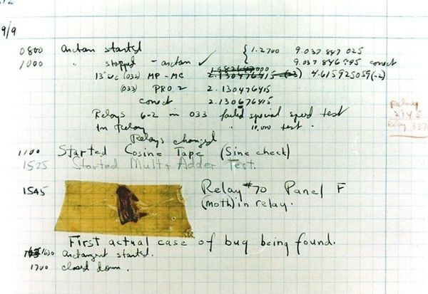

# How to DEBUG 
### (_AN EDUCATIONAL REPO FOR BEGINNERS_)
## Debugging is the process of removing bugs from your code.

### Grace Hopper:
Found the first documented bug. One of the first programmers and pioneers.
In her notes you can find a moth taped to the notebook which was found in a relay that was preventing her code from executing.
first actual case of a bug being found in a computer.

[Computer_History_Museum](https://www.computerhistory.org/tdih/september/9/)

Even though we are not dealing with actual moths these days we will still find bits and pieces of code that will hamper the function of our program.

**The important thing is everyone gets bugs but don't let a bug disheart you, find it and squish that piece of shit**
### Please view the files to start with your learing process

